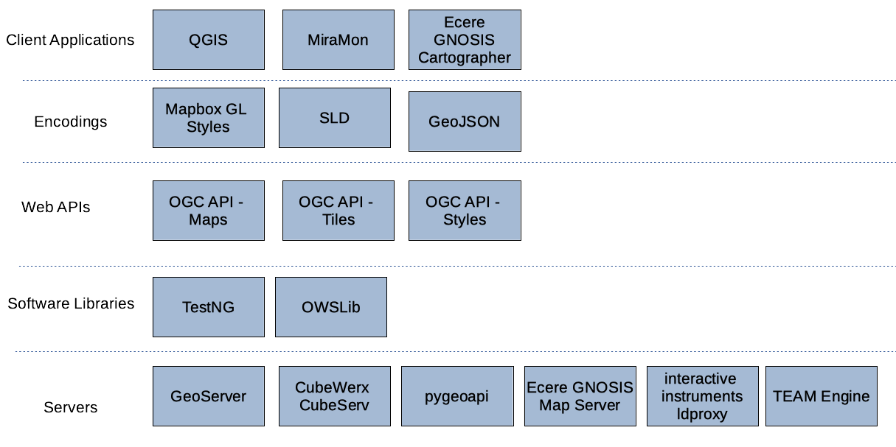

[[architecture]]
== Architecture

=== High Level Overview

The focus of the sprint was on support of the development of the draft https://ogcapi.ogc.org/maps[OGC API - Maps], https://ogcapi.ogc.org/tiles[OGC API - Tiles] and https://ogcapi.ogc.org/styles[OGC API - Styles] standards. Implementations of these draft standards were deployed in participants' own infrastructure in order to build a solution with the architecture shown below in <<img_architecture>>.

[#img_architecture,reftext='{figure-caption} {counter:figure-num}']
.High level overview of the architecture implemented during the sprint

As illustrated, the sprint architecture was designed with the view of enabling client applications to connect to different servers that implement OGC APIs. The servers were provisioned with maps, tiled feature data (colloquially named 'vector tiles'), map tiles, tiled coverage data, and styles.

=== Candidate Standards

==== OGC API - Maps

The draft OGC API - Maps standard describes an API that presents maps portraying data that has been rendered according to a style. The maps served by implementations of the draft OGC API - Maps standard are retrieved as images of any size, generated on-the-fly, and with the styling determined by the client application. The draft standard can be considered the successor to the widely implemented WMS standard. The draft OGC API – Maps standard is a multipart standard that includes a Core (Part 1) and extensions that are planned to be developed in the future.

==== OGC API - Tiles

The draft OGC API - Tiles standard describes an API that implements the http://docs.opengeospatial.org/is/17-083r2/17-083r2.html[OGC Two Dimensional Tile Matrix Set (TMS)] standard to enable access to tiled resources on the Web. The TMS standard defines the rules and requirements for a tile matrix set as a way to index space based on a set of regular grids defining a domain (tile matrix) for a limited list of scales in a CRS. The draft OGC API – Tiles standard is a multipart standard that includes a Core (Part 1) and extensions that are planned to be developed in the future.

==== OGC API - Styles

OGC API - Styles describes the interface and exchange of styling parameters and instructions. The construction of symbology components of styles is addressed in the https://docs.ogc.org/is/18-067r3/18-067r3.html[OGC Symbology Conceptual Model: Core Part] standard and multiple OGC and other style encoding standards.
