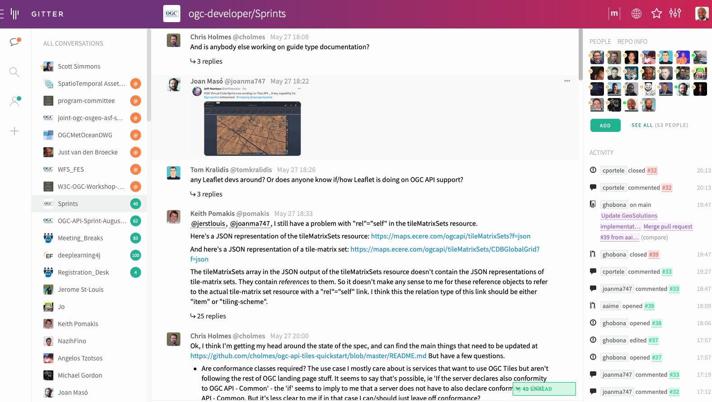
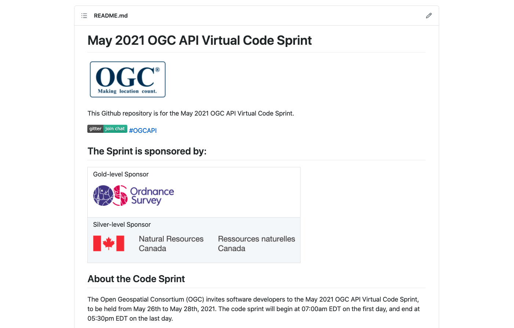

[[discussion]]
== Discussion

The participants used the Gitter platform for written discussion. This was in addition to using Gotomeeting for discussion during the scheduled teleconferences. Individual issues were recorded on the Issues board on GitHub. A screenshot of the Gitter channel is shown below in <<img_gitter>>. The Gitter channel can be found at https://gitter.im/ogc-developer/Sprints

[#img_gitter,reftext='{figure-caption} {counter:figure-num}']
.Screenshot of Gitter channel

A screenshot of the GitHub repository is shown below in <<img_github>>. The GitHub repository can be found at https://github.com/opengeospatial/ogcapi-code-sprint-2021-05

[#img_github,reftext='{figure-caption} {counter:figure-num}']
.Screenshot of GitHub repository

The next subsections provide a summary of the discussion.

=== Topic 1

TBA

=== Topic 2

TBA

=== Topic 3

TBA

=== Immediate Lessons

* The Tiles API is reasonably stable. We have seen different interpretations of how to apply styles to collections maps and the dataset maps.
* Evolution of WKSS into common TMS (the ones that are going to be registered). The evolution has taken us to a conclusion that WKSS may no longer be necessary.
* The concept of buildings blocks has been completely demonstrated. The three APIs have been successfully demonstrated together.
* The sprint has shown that a lot that is common can be shared across the APIs i.e. how much OGC API - Common - Part 2 facilitates the client implementation.
* The interaction between Maps, Tiles, Styles worked well. No major issues came up that could not be verified.
* More work needs to be done on Styles in general. e.g. where we use the styles has an impact on the resources.
* We focused on the API aspects of the styles but not on the formats of the styles. More work is needed on the formats aspects of the styles (e.g. SymCore).
* While in the Tiles API we have developed a metadata model, in the Maps API there has been less interest in developing a specific metadata model.

=== Implications for NMAs

The sprint participants considered what the APIs will do to help meet the needs of NMAs. The following is a summary.

* *Providing the public with access to geospatial data and maps*: The OGC APIs will make it easier for the general public to access maps through regular web browser technologies. For example, through OGC API - Maps it is now possible to access a complete map through a basic URL (i.e. no query parameters). OGC API - Tiles will make it easier to publish maps as vector tiles, which are becoming increasingly popular in the NMA community. The APIs are able to provide data in a way that 2.5D and 3D visualization clients are able to handle.
* *Facilitating analytics*: OGC API - Tiles is able to publish tiled coverage data in such a way that makes it easier to 'stream' coverages for analysis at the screen resolution. This makes it possible to create histograms, vegetation indices, and other analytical reports all at the screen resolution. The flexibility of specifying the origin of the tiles will make it easier to combine regular OGC tiles with other tiles.
* *Reducing barriers to accessing geospatial data*: All of the OGC APIs together make it easier to start with a dataset and then find a way to generate tiles and other resources. The OGC APIs are integrated in a very convenient way. The Styles API makes it possible for NMA's to publish styles from a central location in a way that is consistent with how they publish data. The integrated environment makes it easier to manage things together.
