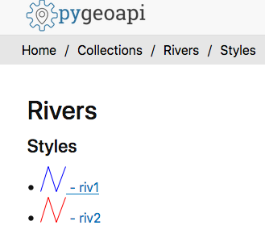

[[discussion]]
== Discussion

The participants used the Gitter platform for written discussion. This was in addition to using Gotomeeting for discussion during the scheduled teleconferences. Individual issues were recorded on the Issues board on GitHub. A screenshot of the Gitter channel is shown below in <<img_gitter>>. The Gitter channel can be found at https://gitter.im/ogc-developer/Sprints

[#img_gitter,reftext='{figure-caption} {counter:figure-num}']
.Screenshot of Gitter channel
image::images/gitter.png[width=800,align="center"]

A screenshot of the GitHub repository is shown below in <<img_github>>. The GitHub repository can be found at https://github.com/opengeospatial/ogcapi-code-sprint-2021-05

[#img_github,reftext='{figure-caption} {counter:figure-num}']
.Screenshot of GitHub repository
image::images/github.png[width=800,align="center"]

The next subsections provide a summary of the discussion.

=== OGC API support for different approaches to organizing styles, layers and data sources

There was a https://github.com/opengeospatial/ogcapi-code-sprint-2021-05/issues/15[discussion] on how OGC APIs could support different approaches to organizing styles, layers and data sources. The sprint participants observed that there are two different approaches of how SLD is used by implementations. One approach involves having the SLD at the top level, whereas the other approach does not. The sprint participants were asked the question "Should we have two conformance classes for the different approaches?".  https://github.com/opengeospatial/ogcapi-styles/issues/5[Issue#5 on the OGC API - Styles repository] includes a proposal on how to change the specification to better support SLD as an encoding. After discussing the topic during the sprint, the sprint participants recommended that: There could be a need to have two separate conformance classes to support the different paradigms, if both are needed in practice. There was also a discussion, if the approach proposed in Issue#5 on the OGC API - Styles GitHub repository conforms to the SLD/SE standards.

=== Support for legends

There was a https://github.com/opengeospatial/ogcapi-code-sprint-2021-05/issues/17[discussion] on the need for support for legends. Currently legends are not supported in OGC API - Maps nor OGC API - Styles, however it is expected that client applications will need or want to present a legend for the information on a map. To facilitate the discussion, CubeWerx provided the paths to a Cubeserv implementation of a legend capability. The paths are listed in <<annex_a,Annex A>>. A screenshot from a prototype built using pygeoapi are shown in <<img_pygeoapi_legend1>>.

[#img_pygeoapi_legend1,reftext='{figure-caption} {counter:figure-num}']
.Screenshot from a legend generated using pygeoapi

The sprint participants also noted that if a legend is a resource in OGC API - Maps, it could be a bitmap graphic of a legend. However, if it is a resource in OGC API - Styles, then it should be a data resource, so that clients can render the legend as they wish and that supports combining information from multiple legends.

=== Changes to a style with multiple occurrences in an API

There was a https://github.com/opengeospatial/ogcapi-code-sprint-2021-05/issues/18[discussion] regarding how changes to a style with multiple occurrences in an API are executed. The sprint participants were asked the question "If a style `foo` is used in several places in an API (that is, there are several resources where the path includes `/styles/foo` somewhere), does a PUT/DELETE on that style affect all occurrences of the style or only the one on which the operation is executed? In other words, is it only one resource with multiple URIs or are these separate resources?". For example, for an implementation that has a "night" style at `/styles/night`, the participants considered whether changes to that style should be propagated to other instances of the same style e.g. `/collection/foo/styles/night`.

After discussing this topic, the sprint participants proposed adding the following statement to the OGC API - Styles specification:

[quote]
____
A service may implement HTTP PUT and/or HTTP DELETE methods for the `/collections/{collectionId}/styles/{styleId}` endpoints. If implemented, these methods shall have the effect of adding/replacing or deleting the definition of the specified style as it pertains to the specified collection. E.g., after a DELETE of `/collections/foo/styles/night`, a future GET of `/collections/foo/styles/night` should return a 404 Not Found, whereas a future GET of `/styles/night` should return a style definition that lacks any mention of collection foo.
____

=== Multiple dimensions in OGC API - Maps

The sprint participants observed that in the Meteorology and Oceanography (MetOcean) context, there is a need to consider addressing dimensions as part of rendering in OGC API - Maps. This need is similar, in part, to the need that triggered the development of the OGC Best Practice for using Web Map Services (WMS) with Time-Dependent or Elevation-Dependent Data. So the Best Practice document can be consulted for information on the approach taken by the previous generation of OGC Web Service Standards. A given collection would need to advertise its dimensions and their relevant extents (e.g. in a MetOcean/Numerical Weather Prediction (NWP) context there could be dimensions for the model run/reference time, forecast time, elevation/pressure level, etc.)

It was noted that the Maps API already supports `datetime` and `subset` parameters, as demonstrated by Ecere's implementation from this sprint and the Hexagon implementation from a previous sprint. Example queries from the Ecere implementation are below:

https://maps.ecere.com/ogcapi/collections/blueMarble/styles/default/map?datetime=2004-07

https://maps.ecere.com/ogcapi/collections/blueMarble/styles/default/map?subset=time(2004-11)

The sprint participants observed that the approach should ideally be the same for non-static tiles or maps as the approach taken for the underlying source data.

If the source data is features, then there is a need to support parameters like datetime, filter, collections, properties, etc. in a way similar to the OGC API - Features resources to filter the features and reduce the properties that are returned. This approach was demonstrated by the ldproxy product and was part of the experiments in the OGC Vector Tiles Pilot 2. An example is below:

https://demo.ldproxy.net/daraa/tiles/WebMercatorQuad/11/827/1229?collections=AgricultureSrf,TransportationGroundCrv&datetime=2012-02-12T00:00:00Z/..&properties=F_CODE

=== Styles, Tiles: Metadata review

The sprint participants conducted a review of the metadata elements specified by OGC APIs for Maps, Tiles, and Styles. The review uncovered that there is significant overlap between the metadata for a style and for a tileset. At the same time, there are issues and differences that should be addressed. Harmonization of the metadata elements, should also be consistent with OGC API - Records. Specific observations and proposals are listed below:

* "title" and "version" are the same.
* "abstract" vs "description". Proposal: use "description".
* "keywords": Styles API uses strings, Tiles API uses a more complex model. Note that the Records API uses strings for "keywords", too. For controlled vocabularies, "themes" is used. Proposal: restrict "keywords" to strings.
* The Styles and Tiles API use "pointOfContact", whereas the Records API uses "contactpoint". Proposal: agree on a single name.
* The Styles and Tiles APIs use "accessConstraints" with a fixed list from the intelligence domain. At the same time more generally useful information like "license" is missing. Proposal: add "license" and drop "accessConstraints". Communities that need the "accessConstraints" elements can always add it through an extension.
* The Tiles API has "publisher", whereas the Styles API does not. The Records API has it, too. Proposal: add "publisher" to the Styles API.
* The Styles API has a fixed "scope" (value "style"), whereas the Tiles API does not. The Records API instead has "type", a URI. Proposal: harmonize.
* The Styles API has various dates in "dates", whereas the Tiles API has them in "date". The Records API only has "created" and "updated", but not embedded in a data type. Proposal: Follow the approach from the Records API.
* The Styles and Tiles APIs both have "layers", but with different content.
** "abstract" vs "description". Proposal: use "description. See #31.
** The Styles API has "type" (point, line, polygon, geometry, raster), whereas the Tiles API has "dataType" (vector, coverage, map) and "geometryType" (points, lines, polygons). Proposal: use "dataType" and "geometryType".
** The Styles API has "attributes" (the OpenAPI 3.0 schema for each attribute), whereas the Tiles API has "propertiesSchema" (a subset of JSON Schema describing an object where each attribute is a property plus some extensions to JSON Schema like "observedProperty" or "uom"). Proposal: Use standard JSON Schema without restrictions. Add a recommendation for a profile, similar to the approach taken by Features for Queryables.
* There is "mediaType" as a string, but the description implies that there can be multiple media types. Proposal: Either change the element to an array, or revise the description to state a maximum occurrence of 1.

There was also an observation made regarding the Tiles API, that the use of scaleDenominator, cellSize and/or the tileMatrix could lead to confusion. This is because every client would have to be able to handle all of them and convert them to the internal mechanism that the client uses. There was a suggestion to pick one to make it easier for clients.

It was acknowledged across the sprint that there is a need to request feedback from Client implementors regarding whether to keep scaleDenominator, cellSize, tileMatrix elements, and that there are several benefits to keeping all of the elements. The sprint participants recommended that, for the Executable Test Suite (ETS), if the server provides the scaleDenominator, cellSize, tileMatrix elements, the ETS should check if they are consistent to a significant number of digits (e.g. at least 12 digits).

After discussing the results of the metadata review, the sprint participants noted that there is a lot of value in dropping the 'accessConstraints' field and going with 'license'. Whereas 'accessConstraints' is used more in implementations of ISO 19115, the term 'license' is used in Dublin Core and DCAT implementations. Therefore, the term 'license' may be the more general term to use - between the two terms.

The sprint participants recommended that a review of the metadata in OGC API - Common, - Maps , -Tiles be carried out and similarities/differences should be discussed in a future multi-SWG meeting.

=== Suggested styleId when creating a style

The Styles API extends on the generic Create/Replace/Delete requirements class, i.e., styles are always created with POST and the server assigns the styleId. The server is free to parse the submitted stylesheet to determine a meaningful `styleId`, if it wants, but that is not possible in style encodings that do not include an identifier.

The Sprint participants noted that this potentially could be addressed by adding an HTTP header that clients could use to suggest a `styleId` with a HTTP POST request. The server would be free to ignore the suggestion. It was also noted that HTTP PUT could also be used for a similar purpose, in accordance with RFC 2616, as demonstrated by the CubeWerx implementation's acceptance of an HTTP PUT `/styles/{styleId}` request to create (or replace) a style with a specific ID. This issue was highlighted for further discussion in the SWGs because HTTP PUT is the typical way of allowing a client to create a resource with a client-defined URI, whereas HTTP POST is for situations where the server should assign a URI.

=== Summary of Code Sprint Outcomes

This section presents a summary of the outcomes of the sprint.

==== Immediate Lessons

* The Tiles API was found to be reasonably stable. However, there appears to be different interpretations of how to apply styles to maps collections and maps of datasets.
* Evolution of the Well Known Scale Set (WKSS) concept into common Tile Matrix Set (TMS) concepts was another outcome. The sprint participants suggested that information provided by WKSS could be derived from a TMS. Further consultation with other OGC Working Groups will be needed to determine the future role of WKSS in the 2D TMS Standard.
* Another key outcome is that the interoperability of buildings blocks has been completely demonstrated. The three APIs have been successfully demonstrated together.
* The sprint has shown that a lot that is common can be shared across the APIs i.e. how much OGC API - Common - Part 2 facilitates the client implementation.
* The interaction between OGC APIs for Maps, Tiles, and Styles worked well. No major issues came up that could not be verified and/or resolved.
* More work needs to be done on the Styles API in general e.g. to determine the impact on API resources when styles are used.
* The code sprint focused on the API aspects of the styles but not on the formats of the styles. More work is needed on the format aspects of the styles (e.g. in relation to the https://docs.ogc.org/is/18-067r3/18-067r3.html[Symbology Core] standard).
* While in the Tiles API a metadata model has been developed, in the Maps API there has been less interest in developing a specific metadata model.

==== Implications for NMAs

The sprint participants considered what the APIs will do to help meet the needs of NMAs. The following is a summary:

* *Providing the public with access to geospatial data and maps*: The OGC APIs will make it easier for the general public to access maps through regular web browser technologies. For example, through OGC API - Maps it is now possible to access a complete map through a basic URL (i.e. no query parameters). OGC API - Tiles will make it easier to publish maps as vector tiles, which are becoming increasingly popular in the NMA community. The APIs are able to provide data in a way that 2.5D and 3D visualization clients are able to handle.
* *Facilitating analytics*: OGC API - Tiles is able to publish tiled coverage data in such a way that makes it easier to 'stream' coverages for analysis at the screen resolution. This makes it possible to create histograms, vegetation indices, and other analytical reports all at the screen resolution. The flexibility of specifying the origin of the tiles will make it easier to combine regular OGC tiles with other tiles.
* *Reducing barriers to accessing geospatial data*: OGC APIs together make it easier to start with a dataset and then find a way to generate tiles and other resources. The OGC APIs are integrated in a very convenient way. The Styles API makes it possible for NMA's to publish styles from a central location in a way that is consistent with how they publish data. The integrated environment makes it easier to manage things together.
